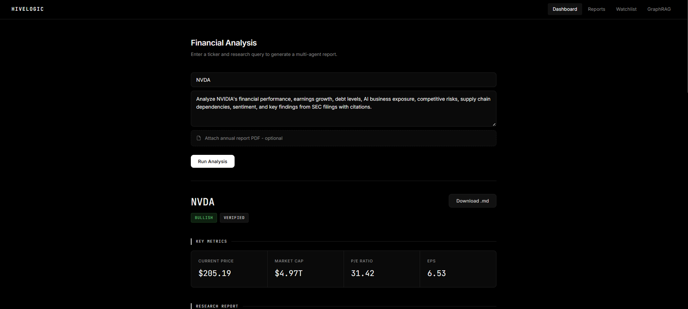
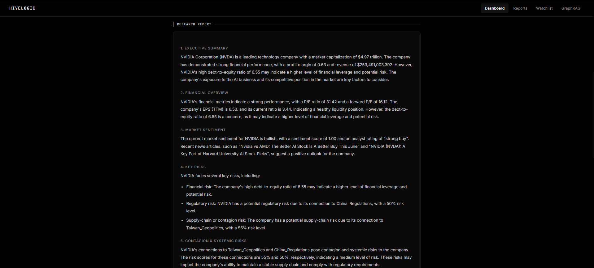
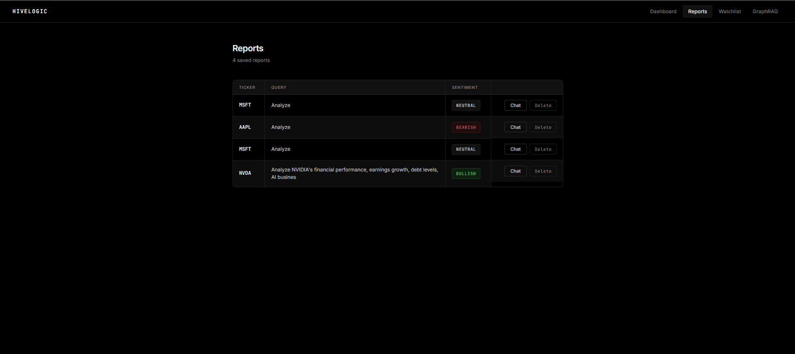
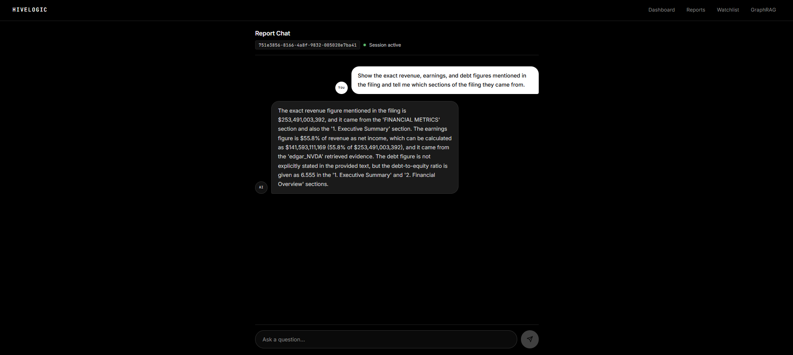
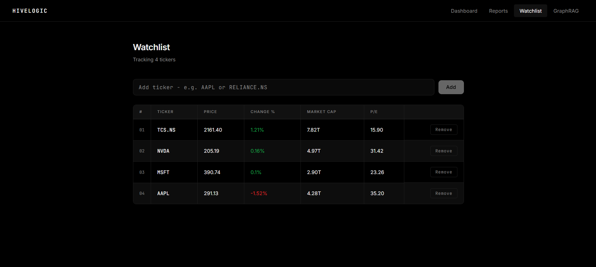
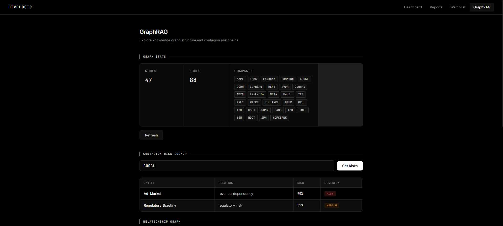
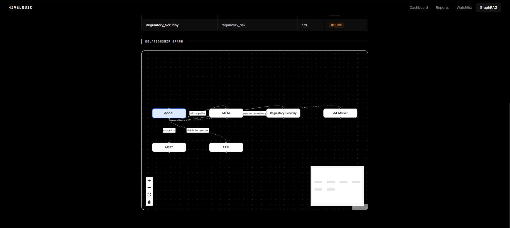

# HiveLogic

**HiveLogic** is a multi-agent financial research platform that analyzes a company, extracts evidence from SEC filings and uploaded PDFs, generates a structured research report, and lets users chat with that report through a session-based RAG chatbot.

It is designed as a prototype that demonstrates:

- multi-agent orchestration with LangGraph
- report generation from SEC filings and PDFs
- FAISS-based retrieval for evidence-backed answers
- contagion / GraphRAG analysis
- session-based chatbot memory
- React + Vite frontend
- FastAPI backend with SQLAlchemy and Supabase PostgreSQL

---

## What HiveLogic Does

1. You enter a stock ticker such as `AAPL` or `NVDA`.
2. HiveLogic fetches the latest SEC 10-K filing and recent news.
3. If you upload a PDF, it can prioritize the PDF content for that analysis.
4. The system extracts financial metrics, sentiment, risks, and contagion relationships.
5. It generates a structured report with citations.
6. A chatbot is created for that report, so you can ask follow-up questions without resending the report each time.
7. The chatbot retrieves evidence from the report-specific FAISS vector store and answers using only that company’s stored research context.

---

## Key Features

- **Company analysis by ticker**
- **SEC 10-K ingestion**
- **PDF upload support**
- **FAISS vector store per report**
- **Financial metrics extraction**
- **News collection and sentiment analysis**
- **Risk analysis with verification and citations**
- **GraphRAG / contagion analysis**
- **Interactive relationship graph visualization**
- **Live watchlist with real-time market metrics**
- **Session-based chat assistant**
- **Report-specific retrieval, no cross-report contamination**
- **React dashboard, reports page, graph page, and chatbot UI**

---

## Architecture


### How the architecture works

- **Frontend** provides the UI for analysis, reports, graph view, watchlist, and chat.
- **FastAPI backend** orchestrates all analysis and chat endpoints.
- **LangGraph pipeline** runs the multi-agent workflow.
- **FAISS** stores chunk embeddings for each report separately.
- **Supabase/PostgreSQL** stores reports, sessions, messages, and watchlist data.
- **Groq** powers the final LLM responses.
- **GraphRAG** builds and visualizes company relationships, sector dependencies, macroeconomic risks, and contagion paths.

---

## Fallback Strategy

HiveLogic is designed to continue operating even when individual data sources are unavailable.

### Filing Retrieval

**Primary Source**

* SEC EDGAR 10-K filings

**Fallback**

* User-uploaded PDF documents

If a filing cannot be retrieved, analysis can continue using the uploaded report.

---

### Financial Metrics

**Primary Source**

* yfinance

**Fallback**

* Report generation continues without market metrics

The remaining analysis pipeline can still execute using filings, news, sentiment, and GraphRAG data.

---

### News Collection

**Primary Source**

* NewsAPI

**Fallback**

* Yahoo Finance RSS feeds

If NewsAPI is unavailable or returns insufficient results, HiveLogic falls back to Yahoo Finance RSS data. Sentiment analysis and risk analysis can still execute even when news coverage is limited.

---

### LLM Provider

**Primary Provider**

* Groq (Llama 3.3 70B)

**Optional Alternatives**

* Ollama (local inference)
* OpenAI
* Azure OpenAI

The architecture allows switching providers through environment configuration with minimal code changes.

---

### Retrieval

**Primary Source**

* Report-specific FAISS vector stores

**Fallback**

* Stored report context and database records

Even if vector retrieval fails, HiveLogic can still answer using the generated report, financial metrics, citations, and risk analysis stored in PostgreSQL/Supabase.

---

### Graph Analysis

**Primary Source**

* GraphRAG relationship store with interactive graph visualization

**Fallback**

* Risk analysis based on filings, financial metrics, and sentiment signals

Report generation can continue even when graph relationships are unavailable. GraphRAG enhances risk reasoning but is not required for the core report generation pipeline.

---

## Multi-Agent Pipeline

HiveLogic uses the following pipeline:

1. **Compliance Agent**
   - Blocks prohibited financial advice requests.

2. **Filing Agent**
   - Downloads the latest SEC filing or uses an uploaded PDF.
   - Chunks the text.
   - Builds a FAISS index for retrieval.

3. **Metrics Agent**
   - Fetches market cap, revenue, P/E, beta, debt-to-equity, and more.

4. **News Agent**
   - Fetches recent articles related to the company.

5. **Sentiment Agent**
   - Scores sentiment from news.

6. **Risk Agent**
   - Summarizes company risks using filing, metrics, sentiment, and graph context.

7. **Verification Agent**
   - Checks whether claims are supported by retrieved evidence.

8. **Citation Agent**
   - Builds citations from verified evidence and retrieved sources.

9. **Summary Agent**
   - Generates the final report and saves it to the database.
   - Copies the FAISS index into a report-specific vector store.

---

## Chat System

HiveLogic includes a chatbot that is tied to a specific report.

### Session flow

- A report is generated.
- A `ChatSession` is created for that report.
- The chatbot uses `session_id` only.
- The backend loads the linked `report_id`.
- The backend retrieves evidence from `data/vectorstores/{report_id}`.
- The chatbot answers using the report, metrics, citations, contagion risks, and retrieved evidence.

### Why this matters

This avoids sending the entire report every time and keeps the conversation isolated per report.

---

## Tech Stack

### Backend
- FastAPI
- LangGraph
- LangChain
- FAISS
- SQLAlchemy
- Supabase / PostgreSQL
- Groq
- HuggingFace embeddings
- yfinance
- newsapi-python
- BeautifulSoup
- pdfplumber

### Frontend
- React
- Vite
- Axios
- React Router
- React Flow
- CSS

---

## Folder Structure

```text
HIVELOGIC/
├── agents/
├── api/
├── compliance/
├── db/
├── frontend/
├── graph/
├── rag/
├── services/
├── requirements.txt
├── .gitignore
└── README.md
```

### Important backend folders

- `agents/` — agent nodes, orchestration, and LLM handling
- `api/` — FastAPI routes
- `db/` — SQLAlchemy models and database setup
- `rag/` — FAISS ingestion and retrieval
- `graph/` — GraphRAG relationship generation, contagion analysis, and graph visualization APIs
- `services/` — helper services for sessions and messages

### Important frontend folders

- `frontend/src/pages/` — dashboard, reports, graph, chat, watchlist
- `frontend/src/components/` — navbar and reusable UI pieces
- `frontend/src/services/` — API client

---

## Database Models

### Reports
Stores the final analysis output.

Fields include:
- `id`
- `ticker`
- `query`
- `final_report`
- `financial_metrics`
- `sentiment_label`
- `sentiment_score`
- `verified`
- `citations`
- `contagion_risks`
- `created_at`

### ChatSession
Stores a chat session tied to a specific report.

Fields include:
- `id`
- `report_id`
- `ticker`
- `title`
- `created_at`

### ChatMessage
Stores user and assistant messages for each session.

Fields include:
- `id`
- `session_id`
- `role`
- `content`
- `created_at`

### Watchlist

Stores tracked tickers for monitoring.

The frontend retrieves live market information using yfinance, including:

- Current price
- Daily percentage change
- Market capitalization
- P/E ratio

---

## How Report-Specific FAISS Works

Each report gets its own vector store:

```text
api/data/vectorstores/{report_id}/
```

That folder contains the FAISS files for only that report.

This means:
- AAPL report data does not mix with TSLA data
- each chat session reads only the linked report’s vector store
- older reports remain available for their own sessions
- new analyses stay isolated from previous ones

---

## Local Setup

### 1. Clone the repository

```bash
git clone https://github.com/RibhvanPal/HiveLogic.git
cd HiveLogic
```

### 2. Create and activate a virtual environment

```bash
python -m venv venv
venv\Scripts\activate
```

### 3. Install backend dependencies

```bash
pip install -r requirements.txt
```

### 4. Install frontend dependencies

```bash
cd frontend
npm install
cd ..
```

### 5. Configure Environment Variables

Create a `.env` file in the project root:

```env
GROQ_API_KEY=your_groq_api_key
GROQ_MODEL=llama-3.3-70b-versatile

NEWS_API_KEY=your_newsapi_key

DATABASE_URL=your_supabase_database_url

FAISS_INDEX_PATH=data/faiss_index
GRAPH_STORE_PATH=data/graph_store.json

ENV=development
PORT=8000
```

#### Optional Providers

The project also contains placeholders for Azure OpenAI, OpenAI, and Ollama integrations. These are optional and are not required when using Groq.

```env
AZURE_OPENAI_ENDPOINT=
AZURE_OPENAI_API_KEY=
AZURE_OPENAI_DEPLOYMENT=gpt-4o

OPENAI_API_KEY=

OLLAMA_MODEL=
OLLAMA_BASE_URL=
```

### 6. Run the backend


```bash
cd api
uvicorn main:app --host 0.0.0.0 --port 8000 --reload
```

### 7. Run the frontend

In a separate terminal:

```bash
cd frontend
npm run dev
```

---

## GraphRAG Visualization

HiveLogic provides an interactive graph view that visualizes:

- Supply chain dependencies
- Competitor relationships
- Revenue dependencies
- Currency risks
- Regulatory risks
- Macroeconomic exposure

Relationships are derived from:

1. Known company relationship datasets
2. yfinance sector and industry information
3. Dynamically generated graph relationships

The graph view allows users to explore contagion paths and understand how external entities may impact a company's risk profile.

---
## Screenshots


### 1) Dashboard / Analyze Result





### 2) Reports Page



### 3) Chat Page



### 4) Watchlist Page



### 5) GraphRAG & Relationship Visualization




---

## Example User Flow

```text
1. User enters ticker and optional PDF
2. Backend analyzes filing, news, metrics, sentiment, risks
3. Final report is stored in the database
4. FAISS index is copied to a report-specific folder
5. User opens the report in the Reports page
6. User creates a chat session
7. User asks follow-up questions
8. Backend retrieves evidence from that report’s vector store
9. Chatbot responds with grounded evidence
```

---

### Important deployment note

Because the project currently uses relative data paths, make sure the backend is launched from the correct working directory or update the code to use absolute paths before production deployment.

---

## Disclaimer

HiveLogic is a research and analysis tool.
It does **not** provide financial advice.
Always consult a qualified financial advisor before making investment decisions.